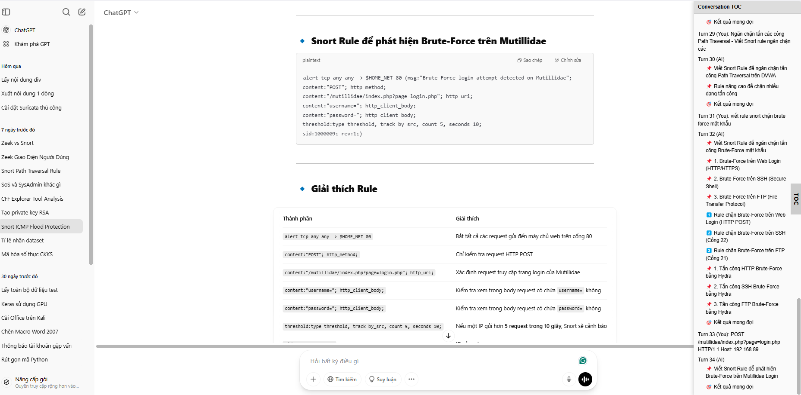

# Extension for AI tools

## Using:
- Dùng:
> py flatten_source_code.py <tên file chứa nền tảng bạn đang dùng>
- Copy `output`
- Tạo thanh dấu trang mới ở trên trình duyệt
- Đặt tên và copy `output` vào URL
- Save

## On AI web:
- Nhấn vào bookmark/extension đã tạo.

## On using:
